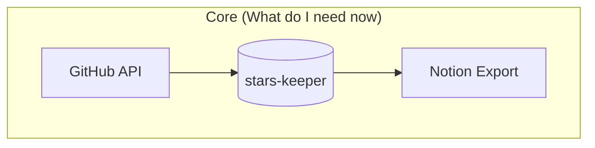

# stars-keeper

*"Hello there!"*, in this repositotiry lies a tool for better management of
your GitHub stars.

## Why

When you teach hundreds of GitHub starred repositories and finding that *one
specific repository* becomes quite the adventure. I have 1.5k...

GitHub's search? *waves hand* "This is not the search you're looking for."

I needed something more... refined. Something that would bring order to this
chaos. Worth mentioning some of these repos are certainly archived or
not-maintained as it would be in a perfect world. So here I am, building an
elegant and simple solution to tackle this challenge.

## Brainstorming

There are several options I can do this:

1. A pragmatic way to rely on a knowledge base with natural text search: Notion
is a great candidate. Notion AI has some credits in a free plan. Should work
just fine in the first iteration.

2. A self-hosted plan: I can have make a system with a simple interface, that
can use my natural query language to search for starred repositories and give
me a result.

3. A hybrid: I can make a tool customisable, let us say I can locally have a list with details (let say in sqlite db), and then export it to where I want, for instance Notion or custom app.

## What I am going to do

I will start with option three, and here we outline the basic architecture:

By doing so, I think, I have plenty of room for future customisation, supporting
different knowledge bases and search engines, that I can use.

## Plan

- [x] I can fetch a list of all starred repositories
- [x] I can fetch information about a specific repository
- [ ] I understand what is a typical structure of my search in stars looks like
- [ ] I can structure this information in a way that I can feed it to LLM and categorize it based on my queries
- [ ] I can generate a new draft of star list
- [ ] I can use this tool to update current star list

## Constraints

- Golang as a primary language
- ... (more to come, since it's great to set your self boundaries and focus on what matters)
